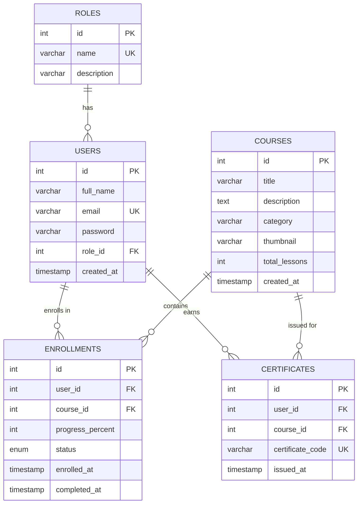
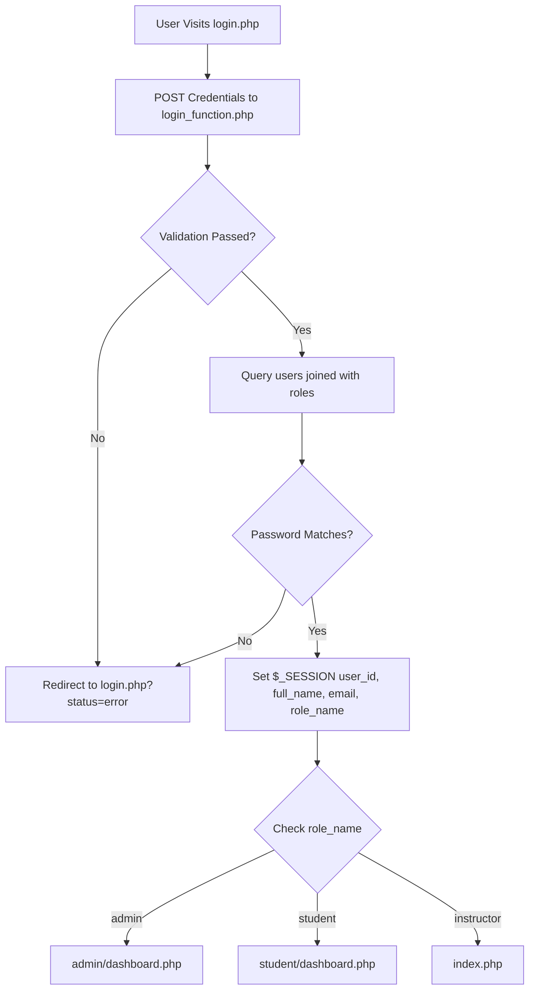

# Adsity - Technical & Functional Documentation

**Version:** 1.0.0  
**Environment:** Linux / LAMPP (XAMPP for Linux)  
**Database:** MariaDB 10.4 (Port 3307)  
**Web Server:** Apache (Port 81)  
**URL Base:** `http://localhost:81/projects/adsity/`

---

## 1. Project Overview

**Adsity** is a web-based educational platform providing free, ad-supported technology courses and verified industry certificates. The system operates on a model where students watch short advertisement breaks throughout lessons in exchange for zero-cost education and credentialing.

### Core User Roles:
- **Student (`role_id = 3`):** Explores courses, tracks enrolled and in-progress learning, finishes courses, and views/prints verified completion certificates.
- **Instructor / Teacher (`role_id = 2`):** Applies/registers to teach, creates curriculum, and shares ad revenue.
- **Administrator (`role_id = 1`):** Superuser with a dedicated monitoring dashboard to oversee all registered students and teachers, inspect system stats, and delete accounts.

---

## 2. Technology Stack

| Layer | Technology | Details |
| :--- | :--- | :--- |
| **Backend** | PHP 8.x | Native procedural PHP with PDO database abstraction |
| **Database** | MariaDB 10.4.32 | Relational schema with Foreign Keys and Cascading Constraints |
| **Session & Auth** | PHP Sessions (`$_SESSION`) | Server-side authentication with role-based access control (RBAC) |
| **Frontend** | HTML5 / CSS3 | Custom CSS (`style.css`), Google Font (*Raleway*, *Cinzel*), Flexbox/Grid |
| **Assets** | Standalone SVG Vectors | Stored in `assets/icons/` and loaded via `` tags |

---

## 3. Directory & File Structure

```
adsity/
├── admin/
│   ├── dashboard.php            # Admin Dashboard view (KPIs, teacher & student monitoring tables)
│   ├── dashboard_function.php   # Admin data handler, queries & session gate (admin only)
│   └── delete_user.php          # Action handler to delete student or teacher records
│
├── assets/
│   ├── Adsity-Homepage-Mockup_Genella.pdf # Original design specification
│   ├── adsity_assets/           # Course thumbnails, branding, and logo images
│   └── icons/                   # Standalone SVG icon vector library
│       ├── alert-circle.svg
│       ├── arrow-left.svg
│       ├── arrow-right.svg
│       ├── award.svg
│       ├── book-open.svg
│       ├── box.svg
│       ├── check-circle.svg
│       ├── clock.svg
│       ├── cloud.svg
│       ├── code.svg
│       ├── download.svg
│       ├── eye.svg
│       ├── globe.svg
│       ├── graduation-cap.svg
│       ├── layout.svg
│       ├── link.svg
│       ├── play.svg
│       ├── shield-check.svg
│       ├── shield.svg
│       ├── trash.svg
│       ├── user-check.svg
│       └── users.svg
│
├── database/
│   ├── config.php               # PDO database connection function getConnection()
│   └── schema.sql               # Complete SQL schema & table definitions
│
├── student/
│   ├── certificate.php          # Verified Certificate view (Print / Save as PDF)
│   ├── certificate_function.php # Certificate lookup and verification query handler
│   ├── dashboard.php            # Student Dashboard view (In-Progress, Completed, Certificates)
│   └── dashboard_function.php   # Student data query handler & session gate (student only)
│
├── courses.php                  # Course Catalog with search keyword & category filters
├── courses_function.php         # Courses query handler with dynamic SQL filters
├── DOCUMENTATION.md             # Detailed project technical documentation
├── index.php                    # Adsity landing page / homepage
├── login.php                    # User authentication login view
├── login_function.php           # Login validation, credential verification & session initialization
├── logout.php                   # Session destruction & logout redirection handler
├── signup.php                   # Student registration view
├── signup_function.php          # Student registration handler & auto-login
├── style.css                    # Global application stylesheet & responsive design system
├── teach.php                    # Instructor application & registration view
├── teach_function.php           # Instructor registration handler & session assignment
└── validation.php               # Centralized input validation functions
```

---

## 4. Database Schema & Architecture

### Entity Relationship Diagram



### Table Definitions:

#### 1. `roles` Table
| Column | Type | Constraints | Description |
| :--- | :--- | :--- | :--- |
| `id` | `INT` | `AUTO_INCREMENT, PRIMARY KEY` | Role Identifier (`1 = admin`, `2 = instructor`, `3 = student`) |
| `name` | `VARCHAR(50)` | `NOT NULL, UNIQUE` | Unique role name (`admin`, `instructor`, `student`) |
| `description`| `VARCHAR(255)` | `NULL` | Role access description |

#### 2. `users` Table
| Column | Type | Constraints | Description |
| :--- | :--- | :--- | :--- |
| `id` | `INT` | `AUTO_INCREMENT, PRIMARY KEY` | Unique User ID |
| `full_name` | `VARCHAR(100)` | `NOT NULL` | User full name |
| `email` | `VARCHAR(150)` | `NOT NULL, UNIQUE` | User login email |
| `password` | `VARCHAR(255)` | `NOT NULL` | User password |
| `role_id` | `INT` | `NOT NULL, DEFAULT 3, FK` | References `roles(id)` |
| `created_at`| `TIMESTAMP` | `DEFAULT CURRENT_TIMESTAMP` | Account registration timestamp |

#### 3. `courses` Table
| Column | Type | Constraints | Description |
| :--- | :--- | :--- | :--- |
| `id` | `INT` | `AUTO_INCREMENT, PRIMARY KEY` | Course ID |
| `title` | `VARCHAR(150)` | `NOT NULL` | Course Title |
| `description`| `TEXT` | `NULL` | Detailed course overview |
| `category` | `VARCHAR(100)` | `NULL` | Category tag (e.g. *Security*, *Development*) |
| `thumbnail` | `VARCHAR(255)` | `NULL` | Filename inside `assets/adsity_assets/` |
| `total_lessons`| `INT` | `DEFAULT 10` | Total lessons in the course |
| `created_at`| `TIMESTAMP` | `DEFAULT CURRENT_TIMESTAMP` | Course creation timestamp |

#### 4. `enrollments` Table
| Column | Type | Constraints | Description |
| :--- | :--- | :--- | :--- |
| `id` | `INT` | `AUTO_INCREMENT, PRIMARY KEY` | Enrollment ID |
| `user_id` | `INT` | `NOT NULL, FK` | References `users(id)` ON DELETE CASCADE |
| `course_id` | `INT` | `NOT NULL, FK` | References `courses(id)` ON DELETE CASCADE |
| `progress_percent`| `INT` | `DEFAULT 0` | Progress (0 - 100%) |
| `status` | `ENUM` | `'in_progress', 'completed'` | Current enrollment state |
| `enrolled_at`| `TIMESTAMP` | `DEFAULT CURRENT_TIMESTAMP` | Enrollment timestamp |
| `completed_at`| `TIMESTAMP` | `NULL` | Completion timestamp |

#### 5. `certificates` Table
| Column | Type | Constraints | Description |
| :--- | :--- | :--- | :--- |
| `id` | `INT` | `AUTO_INCREMENT, PRIMARY KEY` | Certificate Record ID |
| `user_id` | `INT` | `NOT NULL, FK` | References `users(id)` ON DELETE CASCADE |
| `course_id` | `INT` | `NOT NULL, FK` | References `courses(id)` ON DELETE CASCADE |
| `certificate_code`| `VARCHAR(50)`| `NOT NULL, UNIQUE` | Unique credential ID (e.g. `ADS-2026-WD-88421`) |
| `issued_at` | `TIMESTAMP` | `DEFAULT CURRENT_TIMESTAMP` | Certificate issuance timestamp |

---

## 5. Key Workflows & User Flows

### A. Authentication & Session Routing Flow



### B. Student Registration & Dashboard
1. Visitor submits form at [`signup.php`](file:///home/ugenella/coding/xampp-projects/adsity/signup.php).
2. [`signup_function.php`](file:///home/ugenella/coding/xampp-projects/adsity/signup_function.php) validates inputs, inserts record into `users` with `role_id = 3`, sets session variables, and automatically logs the student in.
3. Student lands on [`student/dashboard.php`](file:///home/ugenella/coding/xampp-projects/adsity/student/dashboard.php) which displays:
   - **Metrics:** Active courses, completed courses, and earned certificates counts.
   - **In Progress Cards:** Progress bar, percentage, lessons finished, and "Continue Learning" button.
   - **Completed Cards:** Completion date and "View Certificate" button.
   - **My Certificates:** Verification codes and direct links to [`student/certificate.php`](file:///home/ugenella/coding/xampp-projects/adsity/student/certificate.php).

### C. Instructor Application
1. Instructor submits application at [`teach.php`](file:///home/ugenella/coding/xampp-projects/adsity/teach.php).
2. [`teach_function.php`](file:///home/ugenella/coding/xampp-projects/adsity/teach_function.php) validates inputs, registers user with `role_id = 2` (`instructor`), sets session data, and provides success feedback.

### D. Admin User Monitoring & Management
1. Administrator logs in using `admin@adsity.org` / `admin123`.
2. [`admin/dashboard.php`](file:///home/ugenella/coding/xampp-projects/adsity/admin/dashboard.php) verifies session `role_name === 'admin'` and displays:
   - Total user metrics (Students, Teachers, All Users).
   - **Teachers Table:** Lists all instructors with registration dates and a delete action.
   - **Students Table:** Lists all students with registration dates and a delete action.
3. Deletion requests are processed via [`admin/delete_user.php`](file:///home/ugenella/coding/xampp-projects/adsity/admin/delete_user.php), with built-in safeguards protecting administrator accounts from deletion.

### E. Course Catalog & Exploration
1. Users click **"Explore"** on any page or search from the top navigation bar.
2. [`courses.php`](file:///home/ugenella/coding/xampp-projects/adsity/courses.php) renders the courses catalog with:
   - Text search query parsing (`?search=...`).
   - Category filtering pills (`?category=...`).
   - Course metadata (Lessons, ad-supported free badge, and Enrollment CTA).

---

## 6. Input Validation Architecture

Located in [`validation.php`](file:///home/ugenella/coding/xampp-projects/adsity/validation.php):

- `validateRequired(string $value, string $label): ?string` &mdash; Ensures fields are non-empty.
- `validateEmailFormat(string $value): ?string` &mdash; Validates standard email structure with `FILTER_VALIDATE_EMAIL`.
- `validateMinLength(string $value, string $label, int $min): ?string` &mdash; Enforces minimum string length.
- `validatePasswordMatch(string $password, string $confirmPassword): ?string` &mdash; Ensures confirmation passwords match.
- `validateTerms(bool $termsAccepted): ?string` &mdash; Ensures Terms of Service agreement checkbox is checked.
- `validateSignupInput(array $post): array` &mdash; Aggregates student signup validation errors and sanitized data.
- `validateLoginInput(array $post): array` &mdash; Aggregates login input validation.
- `validateTeacherSignupInput(array $post): array` &mdash; Aggregates instructor registration validation.

---

## 7. Setup & Local Testing Guide

### Prerequisites
- XAMPP / LAMPP installed on Linux.
- Apache running on Port `81`.
- MariaDB running on Port `3307` (or socket `/opt/lampp/var/mysql/mysql.sock`).

### Database Initialization
Import the database schema and default seeds:
```bash
/opt/lampp/bin/mysql -u root -S /opt/lampp/var/mysql/mysql.sock < database/schema.sql
```

### Seed Accounts for Testing

| Role | Email | Password | Target Dashboard |
| :--- | :--- | :--- | :--- |
| **Administrator** | `admin@adsity.org` | `admin123` | `http://localhost:81/projects/adsity/admin/dashboard.php` |
| **Student** | `uzziah@gmail.com` | `password123` | `http://localhost:81/projects/adsity/student/dashboard.php` |

---

## 8. Summary of Vector Assets

All vector icons are organized as standalone SVGs inside [`assets/icons/`](file:///home/ugenella/coding/xampp-projects/adsity/assets/icons/):

| Icon File | Usage |
| :--- | :--- |
| `alert-circle.svg` | Error alert banners across forms and views |
| `arrow-left.svg` | Back to Home and return navigation links |
| `arrow-right.svg` | Submit form buttons and action triggers |
| `award.svg` | Verified certificates badges and credential cards |
| `book-open.svg` | Course catalog, lessons, and in-progress learning icons |
| `box.svg` | Docker container skill badge |
| `check-circle.svg` | Success alerts and completed course indicators |
| `clock.svg` | In-progress time/learning indicators |
| `cloud.svg` | Cloud computing & AWS skill badge |
| `code.svg` | Programming languages (Python, JS, React) skill badges |
| `download.svg` | Download and print certificate actions |
| `eye.svg` | View credential action buttons |
| `globe.svg` | Language and localization selector in navbar |
| `graduation-cap.svg`| Instructor badges and teacher portal identifiers |
| `layout.svg` | UI/UX design skill badge |
| `link.svg` | Blockchain skill badge |
| `play.svg` | Continue learning video module button |
| `shield-check.svg` | 100% Free ad-supported verification badge |
| `shield.svg` | Cybersecurity skill badge |
| `trash.svg` | Delete user action buttons in Admin panel |
| `user-check.svg` | Student KPI indicators in Admin dashboard |
| `users.svg` | Total users KPI card in Admin dashboard |
